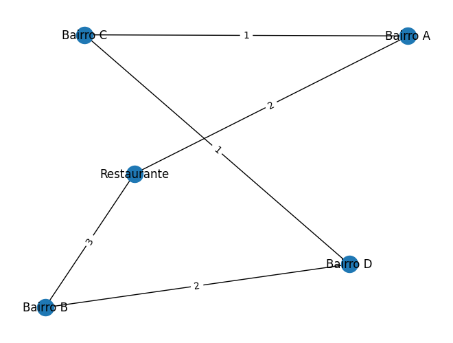

# rota-inteligente-delivery
Projeto de otimização de rotas de entrega utilizando Inteligência Artificial
## Representação do Grafo de Entregas

A cidade foi modelada como um grafo onde:

- os nós representam bairros ou pontos de entrega
- as arestas representam ruas
- os pesos representam distância entre os pontos

